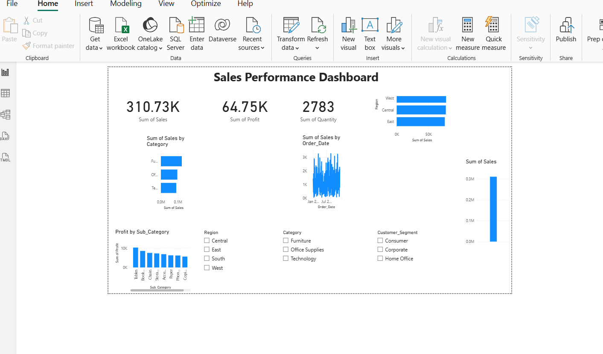

# Business Sales Analysis
A data analytics project that combines Python-based data processing with Power BI dashboard visualization to analyze business sales performance across different regions and product categories.


## Overview

This project analyzes sales performance metrics including total revenue, profitability, and regional sales distribution. It processes order-level transaction data and generates insights through statistical summaries, Python visualizations, and an interactive Power BI dashboard.

## Features

- **Sales Metrics**: Calculate total sales and total profit across all orders
- **Regional Analysis**: Break down sales performance by geographic region
- **Data Visualization**: Generate bar charts to compare sales across regions
- **Data Processing**: Load and analyze structured CSV data using pandas
- **Dashboard Visualization**: Built an interactive Power BI dashboard to present key business insights and KPIs

## Project Structure


### Files

- `sales_analysis.py` - Main Python script for data analysis and visualization
- `sales_data.csv` - Sales transaction dataset (Order_ID, Order_Date, Region, Category, Sub_Category, Customer_Segment, Sales, Profit, Quantity)
- `Readme.md` - Project documentation
- Business_Sales_Dashboard.pbix - Power BI dashboard file for interactive data visualization

## Data Description

The `sales_data.csv` file contains the following columns:

| Column | Description |
|--------|-------------|
| Order_ID | Unique order identifier |
| Order_Date | Date the order was placed |
| Region | Geographic region (East, West, Central, South) |
| Category | Product category (Office Supplies, Furniture, Technology) |
| Sub_Category | Specific product subcategory |
| Customer_Segment | Type of customer (Corporate, Consumer, Home Office) |
| Sales | Revenue amount for the order |
| Profit | Profit amount for the order |
| Quantity | Number of units ordered |

## Requirements

- Python 3.x
- pandas
- matplotlib
- Power BI Desktop

## Installation

Install the required packages:

```bash
pip install pandas matplotlib
```

## Usage

Run the analysis script:

```bash
python sales_analysis.py
```

## Output

The script produces the following outputs:

1. **Total Sales** - Sum of all sales amounts across all orders
2. **Total Profit** - Sum of all profit amounts across all orders
3. **Sales by Region** - Breakdown of total sales for each geographic region:
   - East
   - West
   - Central
   - South
4. **Visual Chart** - Bar chart displaying sales comparison across regions

## Example Output

```
Total Sales: [Total sales amount]
Total Profit: [Total profit amount]
Region
East      [Amount]
West      [Amount]
Central   [Amount]
South     [Amount]
Name: Sales, dtype: float64
```

## Author

Business Sales Analysis Project

## License

Open source

